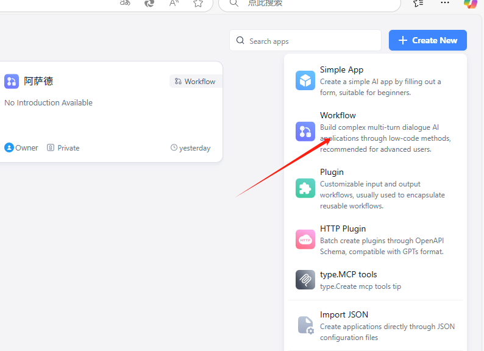
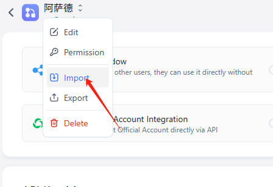
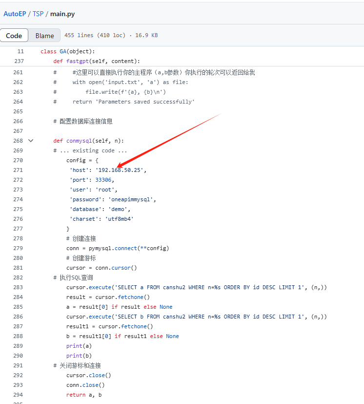
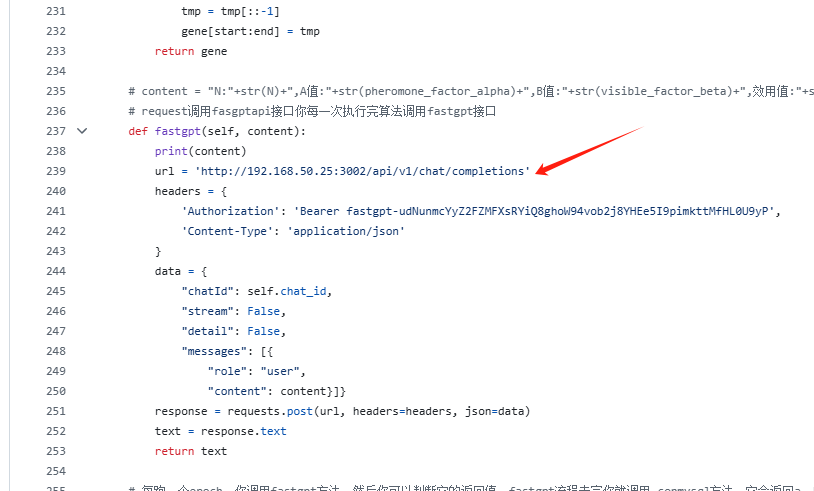
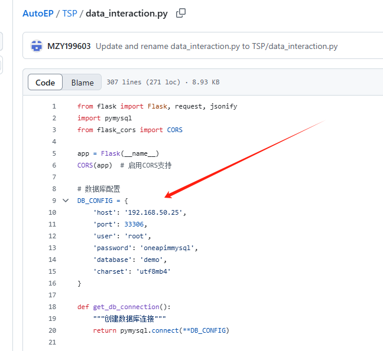

# AutoEP
## [中文](./README.md)||[EN](./README-en.md)
## Introduction
Here are several baselines:
- [eoh](https://github.com/FeiLiu36/EoH)
- [reeov](https://github.com/ai4co/reevo)

## 1. Foundation Building of FastGPT (Agent Framework Building)
[FastGPT](https://github.com/labring/FastGPT) is an efficient knowledge Q&A system based on large language models, supporting private deployment and custom workflow construction.
- **Official GitHub Repository**: [https://github.com/labring/FastGPT](https://github.com/labring/FastGPT)
- **docker-compose**: [https://github.com/labring/FastGPT/blob/main/deploy/docker/docker-compose-oceanbase/docker-compose.yml](https://github.com/labring/FastGPT/blob/main/deploy/docker/docker-compose-oceanbase/docker-compose.yml)

### 1.1 Starting FastGPT with Docker
Execute the `docker-compose up -d` command to start FastGPT.

### 1.2 Connecting Local Models to FastGPT
- **AI Proxy Connection**: You can refer to [https://github.com/labring/FastGPT](https://github.com/labring/FastGPT) to reproduce the code. This is a recommended method. Corresponding to [docker-compose](https://github.com/labring/FastGPT/blob/main/deploy/docker/docker-compose-oceanbase/docker-compose.yml).
- **oneapi Connection**: This method is recommended for long - term use. For the specific connection method, please check [https://doc.tryfastgpt.ai/docs/development/modelconfig/one-api/](https://doc.tryfastgpt.ai/docs/development/modelconfig/one-api/). Corresponding to [docker-compose](https://github.com/MZY199603/AutoEP/edit/main/src/docker-compose.yml).

**Attention!!!**
Compared with connecting to models provided by vendors, it is recommended to connect to privately - deployed large - scale models deployed locally, which can greatly improve experimental efficiency.

### 1.3 API Connection
FastGPT can encapsulate workflows into an API application. For detailed information, please refer to: [https://doc.tryfastgpt.ai/docs/development/openapi/intro/](https://doc.tryfastgpt.ai/docs/development/openapi/intro/).

## 2. Database Deployment

### 2.1 Database Setup
- In this experiment, mysql (8.0.26) is selected for data interaction and storage. The database structure can be viewed in `src/demo.sql`.
- The deployment method can either use docker to pull the image or install and deploy it locally. When using docker for deployment, execute the `docker pull mysql:8.0.26` command to pull the image.

### 2.2 Interactions between the Database and the Algorithm, and between the Database and FastGPT
The database and the FastGPT Agent workflow interact through Flask:
1. **Update the Database**: At the start of each workflow, the utility value of the previous round needs to be updated to the corresponding parameter round.
2. **Database Query**: Provide the hyperparameters and corresponding utility information of 5 rounds for the Agent.
3. **Insert into the Database**: At the end of each workflow, the hyperparameters output by the agent need to be added to the next round.

The interaction between the database and the algorithm mainly involves the output of the large - language model:
4. **Query and Use as Agent Input**: Before each call to the FastGPT workflow, the hyperparameters and utility values of the previous round will be queried and input into FastGPT.

## 3. Example Demonstration (TSP)

### Prerequisite Steps!!!!
The model needs to be configured first. Please refer to Section 1.2 for specific details.

### 3.1 Quick Start Process
1. **Create a New Workflow**: Enter the FastGPT console and click `+ New Workflow` on the right.

2. **Import Configuration**: Use the `workflow_export.json` file provided in this project to import the predefined workflow. After the workflow is imported, replace the model with your configured model, and replace the HTTP module (which corresponds one - to - one with the interface of data_interaction.py) with your local IP address.    


3. **Publish the Workflow**: Click the `Publish` button to activate the workflow and record the generated `workflowId` for API calls. At the same time, replace the `key` in the `fastgpt` method of `main.py` with your own key.


After completing the above three steps, an agent workflow is successfully published. If the code configuration has not been fully modified, it can be published first and updated later. (Click `Save` and the update is completed after publishing).

### 3.2 Starting the Database and Running the main Code
1. **Database Loading**: If you have a graphical database management software, you can directly import the [demo.sql](https://github.com/MZY199603/AutoEP/edit/main/src/demo.sql) file into mysql. If not, you need to mount the `demo.sql` to the mysql container and run it.
2. **Database Configuration**: After successfully configuring the database, you need to modify the database configuration of `conmysql(self, n)` in `main.py` to your own database configuration, and also make corresponding modifications in `data_interaction`.
3. **Code Execution**:
    - Step 1: Start `data_interaction.py`. Running this file requires installing packages such as Flask and pymysql. After successful startup, you can check the running status of the data interface.
    - Step 2: Start the `main.py` file. Before starting, check:
        - Whether the Http module in the agent workflow matches the port and IP of `data_interaction`.
        - Whether the model is configured successfully. You can first build a simple workflow for testing.
        - Whether the replacement operation in Step 3 of Section 3.1 is completed.
After completing the above three checks, you can run `main.py`.

## 4. OneApi Model Connection (Not required for reproducing this experiment for now. If needed, refer to the following content)

### Deployment via the `src/docker-compose.yaml` Provided in This Article
1. Open the oneapi website. After deploying according to the above `docker-compose`, the access address is the local route address: 3013.
2. Open the "Channels" on the navigation bar, add a new channel, select the custom channel, and fill in the Base_url, channel name, model name, and your KEY. The model name, Base_url, and key need to be obtained from sources such as deepseek and openai and filled in. If it is a locally deployed model, it needs to support the openai interface for invocation.


3. If using oneapi for the first time, click in the Token column to obtain the token and key, and then modify the following two items in the fastgpt configuration of `docker-compose.yaml`:
    - `OPENAI_BASE_URL=http://Local IP or Route IP:3013/v1`
    - `CHAT_API_KEY=The key just obtained` (initially, the quick default key of OneAPI is filled in. After testing is successful, modify it to the newly obtained token key).
4. After adding an LLM, you need to add the added channel in the `config.json` file. An example is as follows:
```json
"llmModels": [{ 
    "model": "gpt-3.5-turbo", // Model name  
    "name": "gpt-3.5-turbo", // Fill in the newly added channel name. The following items can be adjusted as needed and can remain unchanged.  
    "maxContext": 16000, 
    "avatar": "/imgs/model/openai.svg", 
    "maxResponse": 4000, 
    "quoteMaxToken": 13000, 
    "maxTemperature": 1.2, 
    "charsPointsPrice": 0,
    "censor": false, 
    "vision": false,
    "datasetProcess": true,
    "usedInClassify": true,
    "usedInExtractFields": true,
    "usedInToolCall": true,
    "usedInQueryExtension": true,
    "toolChoice": true,
    "functionCall": true,
    "customCQPrompt": "",
    "customExtractPrompt": "",
    "defaultSystemChatPrompt": "",
    "defaultConfig": {}
}]
```


# Quick Experiment Reproduction Using TSP as an Example

## Overall Flowchart


## Environment Setup and Execution

1. &zwnj;**Pull the Latest Version of FastGPT Using Docker Compose**&zwnj;  
   Ensure Docker and Docker Compose are installed. Install Docker Compose with:  
   ```bash
   # Install Docker Desktop (includes Docker Compose)
   # Or install Docker Compose separately:
   sudo curl -L "https://github.com/docker/compose/releases/download/v2.23.0/docker-compose-$(uname -s)-$(uname -m)" -o /usr/local/bin/docker-compose
   sudo chmod +x /usr/local/bin/docker-compose
   Start  FastGPT with `docker-compose` ：
   [docker-compose](https://github.com/labring/FastGPT/blob/main/deploy/docker/docker-compose-oceanbase/docker-compose.yml)
   ```bash
   docker-compose up  
   ```

   For manual MySQL setup and data import:
   ```bash
   docker pull mysql
   # Import demo.sql file
   docker exec -i mysql_container_name mysql -u root -p database_name < demo.sql
   ```
   Use local databases directly if available.

2. **‌Configure FastGPT After Startup**  
   Access the FastGPT launch page (default credentials: root/1234). Configure the LLM and embedding models. Obtain API Keys from DeepSeek, OpenAI, etc., or use local deployments (currently supports OpenAI-compatible interfaces). 

3. **‌Establish Interconnection Between data_interaction.py and MySQL**  
   Update MySQL configuration with your credentials and install dependencies (e.g., Flask):
   ```bash
   pip install flask
   etc..
   python
   run data_interaction.py
   ```
   Record the service IP and port displayed in the terminal.

4. **‌Create and Import Workflow**  
   ### Model and Interface Configuratio
    1. &zwnj;**‌Model Replacement**&zwnj;  
       - Path: `FastGPT Console > Workflow Editor > Model Configuration` 
       - Select your deployed model (e.g., qwen2.5-7b-instruct)  
       - Import workflow: `New Blank Workflow > Your Workflow Name > Import Workflow` 
       - Verify API endpoint matches data_interaction service (e.g., 192.168.50.24:5000）
    2. &zwnj;**HTTP Module Settings**&zwnj;  
       ```yaml
       - replace your http Module to your server ip 
       http_modules:
         - name: "Genetic Algorithm Parameter Interface"
           url: "http://{{SERVER_IP}}:5000/api/v1/process"
           timeout: 5000
       - Click Save and Publish > Select API Request channel and generate Key (record this key)
    3. &zwnj;**‌Key Generation**&zwnj;
       - Obtain API_KEY from: API Management > Key Managemen

5. **Modify Configurations in TSP Main File (main.py)**  
   Update MySQL and FastGPT connection settings with your deployment details and generated Key. Start the experiment:
   Modify port configurations as shown:
   
   
   
      ```bash
   python
   run main.py
   run data_interaction.py
   ``
   Verify connectivity between MySQL, FastGPT, and the Python FastAPI service. Configuration order can be adjusted.
  
# AutoEP Workflow Core Node Details

## TSP Workflow Node Description


### 1. Input Parsing Node
- &zwnj;**Function**&zwnj;: Receives current iteration data from user input
- &zwnj;**Input Format**&zwnj;: `N:2,A_value:1.5,B_value:1.8,Utility_value:48001000`
- &zwnj;**Purpose**&zwnj;: Initiates workflow and transmits current state data

### 2. Parameter Extraction Node
- &zwnj;**Function**&zwnj;: Extracts key parameters from input text
- &zwnj;**Extracted Content**&zwnj;:
  - N (iteration count)
  - y (utility value)
- &zwnj;**Model Used**&zwnj;: qwen2.5-7b-instruct-1m
- &zwnj;**Extraction Rule**&zwnj;:
  `"Given the following input: \nN:2,A_value:1.5,B_value:1.8,Utility_value:48001000\nExtract only the values of N and Utility_value"`

### 3. Historical Data Judgment Node
- &zwnj;**Decision Logic**&zwnj;:
  `if N >= 1: Execute Historical Data Analysis Path else: Execute Direct Decision Path`
- &zwnj;**Purpose**&zwnj;: Determines whether to use historical data for analysis

### 4. Historical Data Analysis Path
a. &zwnj;**Data Update Node**&zwnj;
- &zwnj;**Function**&zwnj;: Sends current iteration data to backend
- &zwnj;**API Endpoint**&zwnj;: `http://192.168.50.24:5000/canshu2`
- &zwnj;**Parameters Sent**&zwnj;:
  - n (iteration count)
  - y (utility value)
  - chatid (session ID)

b. &zwnj;**Data Query Node**&zwnj;
- &zwnj;**Function**&zwnj;: Queries historical parameter data
- &zwnj;**API Endpoint**&zwnj;: `http://192.168.50.24:5000/select`
- &zwnj;**Query Parameter**&zwnj;: chatid (session ID)

c. &zwnj;**Analysis Prompt Generation Node**&zwnj;
- &zwnj;**Prompt Template**&zwnj;:
  `"In genetic algorithms, the objective function value y changes with iteration n. Given the following data: {{historical_data}}, each entry contains hyperparameters along with n and y values. If y remains constant, the algorithm must increase exploration; if y continuously decreases with n, the algorithm can increase exploitation. Determine whether exploration or exploitation is needed..."`

d. &zwnj;**Analysis Model Node**&zwnj;
- &zwnj;**Function**&zwnj;: Analyzes algorithm state (exploration/exploitation)
- &zwnj;**Model Used**&zwnj;: qwen-max-latest
- &zwnj;**Output**&zwnj;: Exploration or exploitation recommendation

### 5. Decision Path
a. &zwnj;**Decision Prompt Generation Node**&zwnj;
- &zwnj;**Prompt Template**&zwnj;:
  `"(Decision LLM) LLM3:\nHow should hyperparameters (crossover probability and mutation probability) be adjusted when genetic algorithms need to increase exploration? How should they be adjusted when needing to increase exploitation? Current requirement: increase {{analysis_result}}..."`

b. &zwnj;**Decision Model Node**&zwnj;
- &zwnj;**Function**&zwnj;: Generates parameter adjustment strategy
- &zwnj;**Model Used**&zwnj;: qwen-max-latest
- &zwnj;**Output**&zwnj;: Parameter adjustment suggestion (e.g., "Increase crossover probability, decrease mutation probability")

### 6. Parameter Generation Path
a. &zwnj;**Parameter Generation Prompt Node**&zwnj;
- &zwnj;**Prompt Template**&zwnj;:
  `"You are highly proficient in genetic algorithms and TSP tasks... Current hyperparameters: {{user_input}}. The algorithm now needs to increase {{decision_result}}... Valid ranges: A > 0.4 and < 0.8, B > 0.05 and < 0.8..."`

b. &zwnj;**Parameter Generation Model Node**&zwnj;
- &zwnj;**Function**&zwnj;: Generates new parameter values
- &zwnj;**Model Used**&zwnj;: qwen-max-latest
- &zwnj;**Output Format**&zwnj;: `<A>0.65</A> <B>0.12</B>`

c. &zwnj;**Parameter Extraction Node**&zwnj;
- &zwnj;**Extraction Rule**&zwnj;:
  `"Example: <A>0.3</A> <B>0.5</B>\nPlease extract numerical values of A and B from the text!"`
- &zwnj;**Output**&zwnj;: Numerical values of A and B

### 7. Parameter Storage Node
- &zwnj;**Function**&zwnj;: Stores new parameters in backend
- &zwnj;**API Endpoint**&zwnj;: `http://192.168.50.24:5000/canshu`
- &zwnj;**Parameters Sent**&zwnj;:
  - a (crossover probability)
  - b (mutation probability)
  - n (current iteration count)
  - chatid (session ID)

## Workflow Features

### 1. Multi-Model Collaborative Architecture
- Utilizes 3 different AI models working collaboratively:  
  `Analysis Model → Decision Model → Parameter Generation Model`

### 2. Parameter Constraint Mechanism
- Enforces parameter range constraints:
  - A ∈ (0.4, 0.8)
  - B ∈ (0.05, 0.8)
- Automatically uses boundary values when out-of-range

### 3. State-Aware Optimization
- Dynamically adjusts exploration/exploitation balance  
  based on utility value trend (y relative to n changes)

### 4. Iteration-Aware Processing
- Distinguishes between initial and subsequent iterations  
  Skips historical analysis step during initial iterations

### 5. Session Persistence
- Uses chatid to track entire optimization session  
  Ensures parameter consistency across multiple iterations

## Workflow Diagram


## Explanations and Potential Issues

1. **Document Extraction Module in Workflow**  
   The first workflow module uses an LLM to extract input N values. This can alternatively be hardcoded or handled via a function call .

2. **Runtime Monitoring**  
   Monitor experiments via chat logs and inspect data interactions between modules .

3. **Model Selection Recommendations**  
   Larger-parameter models perform better. Offline local deployment improves efficiency (stably runs 500+ epochs after optimization) .

4. **Avoid Inference-Optimized Models**  
   Inference models are discouraged due to poor extraction quality and slow speed (though combining multiple LLMs may enhance performance).
