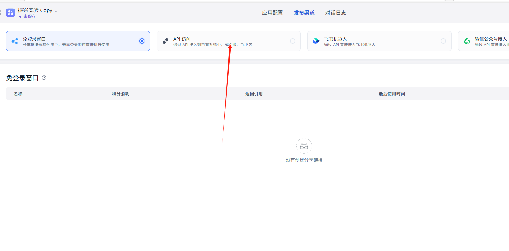

# AutoEP

## 简介     
以下是几个baseline  
[eoh]:(https://github.com/FeiLiu36/EoH)   
[reeohh=]:(https://github.com/ai4co/reevo)   

## 1.fastgpt的基础构建（Agent框架构建）
[FastGPT](https://github.com/labring/FastGPT) 是一个基于大语言模型的高效知识问答系统，支持私有化部署和自定义工作流搭建。  
🔗 **官方GitHub仓库**: [https://github.com/labring/FastGPT](https://github.com/labring/FastGPT)  
🔗 **docker-compose**: [https://github.com/labring/FastGPT/blob/main/deploy/docker/docker-compose-oceanbase/docker-compose.yml]  
### 1.1 fastgpt的docker启动 
运行 docker-compose up-d
### 1.2 fastgpt接入本地模型 
AI Proxy接入:[https://github.com/labring/FastGPT](https://github.com/labring/FastGPT)  复现代码推荐  
oneapi 接入 ：[https://doc.tryfastgpt.ai/docs/development/modelconfig/one-api/]  长期使用推荐  
#### attention！！！ 
   相较于接入供应商的模型，建议接入本地部署的私有化大模型，实验效率能倍增。 
### 1.3 API接入
fastgpt可以将工作流封装成一个api应用，详情请见：[https://doc.tryfastgpt.ai/docs/development/openapi/intro/]

## 2.数据库部署
### 2.1 数据库搭建  
本实验采用mysql（8.0.26）用于数据的交互和存储，数据库结构见src/demo.sql。 
可以采用docker方式pull镜像，也可以本地安装部署。 
docker pull mysql：8.0.26 
### 2.2 数据库与算法交互和数据库与fastgpt交互 
   数据库和fastgptAgent工作流交互（通过Flask）   
**1.更新数据库**       
   - 在每次工作流的开始时，需要将上一轮的效用值更新到对应参数的轮中    
**2.数据库查询**       
   - 提供给Agent 5轮次的超参数和对应的效用信息。    
**3.插入数据库**       
   - 在每次工作流结束时，需要将agent输出的超参数新增入下一轮。    
数据库和算法的交互主要是把大模型的输出    
**4.查询并作为agent输入**   
   - 每次调用Fastgpt工作流之前，会查询前一轮次的超参数和效用值，并输入给fastgpt    

## 3. 实例演示（TSP）   
### 预先步骤！！！！    
先配置模型！参考1.2节    
### 3.1快速启动流程     
 第一步 **新建工作流**     
   - 进入 FastGPT 控制台，点击右侧 `+ 新建工作流`。    
 第二步 **导入配置**      
   - 使用本项目提供的 `workflow_export.json` 文件导入预定义工作流。工作流导入完成后把模型替换成你配置的模型。    
 第三步 **发布工作流**      
   - 点击 `发布` 按钮激活工作流，记录生成的 `workflowId` 供 API 调用。需要把你的key替换掉main.py的fastgpt方法中的key。    
     
经过该三步就成功的发布了一个agent工作流，但还需要做些调整，你需要把HTTP的模块替换成你本地的iP地址。    
### 3.2 数据库的启动和main代码运行    
  数据库加载：如果你有图形化管理的数据库软件，那么你只需将：[src/demo.sql]sql文件导入进mysql即可。没有的话，你需要将demo.sql挂载进入mysql容器，并运行它。     
  数据库配置：成功配置完后，你需要修改main.py中的conmysql(self, n)的数据库配置，修改为你的数据库配置，同样的在data_interaction你也需要修改成你的数据库配置。      
  代码运行：第一步：启动data_interaction.py,需要Flask, pymysql等包，启动成功后你可以看到你数据接口的运行状态。    
  第二步：启动main.py文件，启动前的检查工作。 1.agent工作流中的Http的模块是否和data_interaction的端口IP是匹配的。     
  2.模型是否配置成功，可以先搭建简易工作流进行测试。    
  3. 3.1节的第三步是否进行了替换。    
 上述三项检测完成后，即可开始运行main.py。     
  

## 4. OneApi模型接入（如果你需要的话，复现本实验暂时不需要） 
### 通过本文提供的`src/docker-compose.yaml`进行部署 
1. 打开oneapi网站，按上述docker-compose部署后访问地址为 ---本地路由地址：3013 
2. 打开导航条上的渠道，添加新的渠道，选择自定义渠道，填入Base_url，渠道名称，和模型名称和你的KEY。 
模型名称和Base_url和key需要你在deepseek，openai等获取后填入，或者是你本地部署的模型，但是要能支持openai的接口方式调用的。 
   
   
4. 如果你是首次使用oneapi的话你需要点击令牌列获取你的令牌和key，然后把docker-compose.yaml的fastgpt配置中的进行修改下面两项 
 --- OPENAI_BASE_URL=http://本地IP或路由IP:3013/v1 
 ---  AI模型的API Key。（开始时默认填写了OneAPI的快速默认key，测试通后，修改为你刚刚获取的令牌key）CHAT_API_KEY=刚刚获得的key  
5. 增加了LLM以后，需要在配置config.json文件中增加添加的渠道，"llmModels": [{ 
      "model": "gpt-3.5-turbo", //模型名称  
      "name": "gpt-3.5-turbo", //填入你新增的渠道名称，下述其他按照需要进行调整，可以不变。  
      "maxContext": 16000, 
      "avatar": "/imgs/model/openai.svg", 
      "maxResponse": 4000, 
      "quoteMaxToken": 13000, 
      "maxTemperature": 1.2, 
      "charsPointsPrice": 0,
      "censor": false, 
      "vision": false,
      "datasetProcess": true,
      "usedInClassify": true,
      "usedInExtractFields": true,
      "usedInToolCall": true,
      "usedInQueryExtension": true,
      "toolChoice": true,
      "functionCall": true,
      "customCQPrompt": "",
      "customExtractPrompt": "",
      "defaultSystemChatPrompt": "",
      "defaultConfig": {}
    },
...]
   5.配置完成后需要重启服务
   命令 docker-compose down
   docker-compose up-d
   6.workflow中所有LLM换成你配置的LLM即可
   

     
