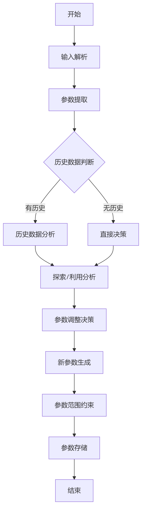
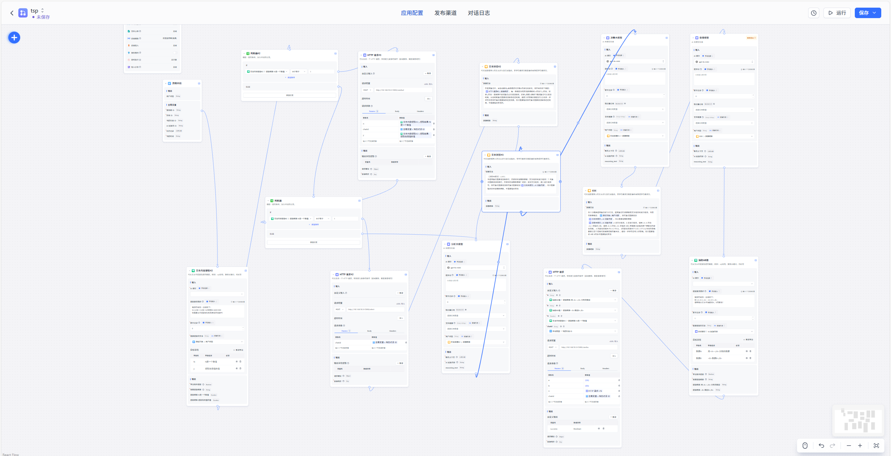

# AutoEP
## [中文](./README.md)||[EN](./README-en.md)
## 简介
以下是几个基线：
- [eoh](https://github.com/FeiLiu36/EoH)
- [reeov](https://github.com/ai4co/reevo)

## 1. FastGPT的基础构建（Agent框架构建）
[FastGPT](https://github.com/labring/FastGPT)是一个基于大语言模型的高效知识问答系统，支持私有化部署和自定义工作流搭建。
- **官方GitHub仓库**：[https://github.com/labring/FastGPT](https://github.com/labring/FastGPT)
- **docker-compose**：[https://github.com/labring/FastGPT/blob/main/deploy/docker/docker-compose-oceanbase/docker-compose.yml](https://github.com/labring/FastGPT/blob/main/deploy/docker/docker-compose-oceanbase/docker-compose.yml)

### 1.1 FastGPT的docker启动
执行`docker-compose up -d`命令启动FastGPT。

### 1.2 FastGPT接入本地模型
- **AI Proxy接入**：可参考[https://github.com/labring/FastGPT](https://github.com/labring/FastGPT)进行复现代码，这是一种推荐方式。对应[docker-compose](https://github.com/labring/FastGPT/blob/main/deploy/docker/docker-compose-oceanbase/docker-compose.yml)    
- **oneapi接入**：长期使用推荐此方式，具体接入方法可查看[https://doc.tryfastgpt.ai/docs/development/modelconfig/one-api/](https://doc.tryfastgpt.ai/docs/development/modelconfig/one-api/) 。对应[docker-compose](https://github.com/MZY199603/AutoEP/edit/main/src/docker-compose.yml)

**注意！！！**
相较于接入供应商的模型，建议接入本地部署的私有化大模型，这样实验效率能大幅提升。

### 1.3 API接入
FastGPT可将工作流封装成一个API应用，详细内容请查阅：[https://doc.tryfastgpt.ai/docs/development/openapi/intro/](https://doc.tryfastgpt.ai/docs/development/openapi/intro/) 。

## 2. 数据库部署
### 2.1 数据库搭建
- 本实验选用mysql（8.0.26）进行数据的交互和存储，数据库结构可查看`src/demo.sql`。
- 部署方式既可以采用docker拉取镜像，也能在本地进行安装部署。使用docker部署时，执行`docker pull mysql:8.0.26`命令拉取镜像。

### 2.2 数据库与算法交互和数据库与FastGPT交互
数据库和FastGPT Agent工作流通过Flask进行交互：
1. **更新数据库**：在每次工作流开始时，需将上一轮的效用值更新到对应参数的轮次中。
2. **数据库查询**：为Agent提供5轮次的超参数和对应的效用信息。
3. **插入数据库**：在每次工作流结束时，要将agent输出的超参数新增到下一轮。

数据库和算法的交互主要是把大模型的输出：
4. **查询并作为agent输入**：每次调用FastGPT工作流前，会查询前一轮次的超参数和效用值，并输入给FastGPT。

## 3. 实例演示（TSP）
### 预先步骤！！！！
需先配置模型，具体参考1.2节内容。

### 3.1 快速启动流程
1. **新建工作流**：进入FastGPT控制台，点击右侧的`+新建工作流`。

2. **导入配置**：使用本项目提供的`workflow_export.json`文件导入预定义工作流。工作流导入完成后，将模型替换为自己配置的模型，需将HTTP模块（与data_interaction.py的接口一一对应）替换为本地的IP地址。    

3. **发布工作流**：点击`发布`按钮激活工作流，并记录生成的`workflowId`，用于API调用。同时，需要将`main.py`的`fastgpt`方法中的`key`替换为自己的key。


完成上述三步后，就成功发布了一个agent工作流，代码配置如果没有完成修改可以先发布，后续再更新。（点击保存且发布完成更新）

### 3.2 数据库的启动和main代码运行
1. **数据库加载**：若有图形化管理的数据库软件，直接将[demo.sql](https://github.com/MZY199603/AutoEP/edit/main/src/demo.sql)文件导入mysql即可；若没有，则需将`demo.sql`挂载到mysql容器并运行。
2. **数据库配置**：成功配置数据库后，需修改`main.py`中的`conmysql(self, n)`的数据库配置为自己的数据库配置，同时在`data_interaction`中也进行相应修改。
3. **代码运行**：
    - 第一步：启动`data_interaction.py`，运行该文件需要安装Flask、pymysql等包。启动成功后，可查看数据接口的运行状态。
    - 第二步：启动`main.py`文件，启动前需进行检查：
        - agent工作流中的Http模块与`data_interaction`的端口IP是否匹配。
        - 模型是否配置成功，可先搭建简易工作流进行测试。
        - 3.1节的第三步是否完成替换操作。
    上述三项检查完成后，即可运行`main.py`。

## 4. OneApi模型接入（复现本实验暂时不需要，若有需要可参考以下内容）
### 通过本文提供的`src/docker-compose.yaml`进行部署
1. 打开oneapi网站，按上述`docker-compose`部署后，访问地址为本地路由地址：3013。
2. 打开导航条上的“渠道”，添加新的渠道，选择自定义渠道，填入Base_url、渠道名称、模型名称以及你的KEY。模型名称、Base_url和key需从deepseek、openai等获取后填入，若是本地部署的模型，则需支持openai的接口方式调用。


3. 若首次使用oneapi，需点击令牌列获取令牌和key，然后修改`docker-compose.yaml`的fastgpt配置中的以下两项：
    - `OPENAI_BASE_URL=http://本地IP或路由IP:3013/v1`
    - `CHAT_API_KEY=刚刚获得的key`（开始时默认填写了OneAPI的快速默认key，测试通过后，修改为新获取的令牌key）
4. 增加LLM后，需在配置`config.json`文件中增加添加的渠道，示例如下：
```json
"llmModels": [{ 
    "model": "gpt-3.5-turbo", //模型名称  
    "name": "gpt-3.5-turbo", //填入新增的渠道名称，下述其他按照需要进行调整，可以不变。  
    "maxContext": 16000, 
    "avatar": "/imgs/model/openai.svg", 
    "maxResponse": 4000, 
    "quoteMaxToken": 13000, 
    "maxTemperature": 1.2, 
    "charsPointsPrice": 0,
    "censor": false, 
    "vision": false,
    "datasetProcess": true,
    "usedInClassify": true,
    "usedInExtractFields": true,
    "usedInToolCall": true,
    "usedInQueryExtension": true,
    "toolChoice": true,
    "functionCall": true,
    "customCQPrompt": "",
    "customExtractPrompt": "",
    "defaultSystemChatPrompt": "",
    "defaultConfig": {}
}]
```
   5.配置完成后需要重启服务
   - 命令 docker-compose down    
   - docker-compose up-d        
   - workflow中所有LLM换成你配置的LLM即可          
   


# 以 TSP 为例，快速复现实验
## 整体流程图

## 环境配置和运行

1. **使用 Docker Compose 下拉最新版本的 FastGPT**  
   首先确保已安装 Docker 和 Docker Compose。可以通过以下命令安装 Docker Compose：
   ```bash
   # 安装 Docker Desktop（包含 Docker Compose）
   # 或者单独安装 Docker Compose
   sudo curl -L "https://github.com/docker/compose/releases/download/v2.23.0/docker-compose-$(uname -s)-$(uname -m)" -o /usr/local/bin/docker-compose
   sudo chmod +x /usr/local/bin/docker-compose
   ```

   使用 `docker-compose` 启动 FastGPT：
   [docker-compose](https://github.com/labring/FastGPT/blob/main/deploy/docker/docker-compose-oceanbase/docker-compose.yml)
   ```bash
   docker-compose up  
   ```

   如果需要手动下载 MySQL 并导入数据：
   ```bash
   docker pull mysql
   # 导入 demo.sql 文件
   docker exec -i mysql_container_name mysql -u root -p database_name < demo.sql
   ```
   如果有本地数据库的，直接导入即可。

2. **启动后配置 FastGPT**  
   打开 FastGPT 的启动页面，默认账号为 `root`，密码为 `1234`。进入后需配置好 LLM 模型和向量模型。可以从 DeepSeek、OpenAI 等渠道获取 API Key，也可以选择本地部署（目前仅支持通过 OpenAI 接口调用）。

3. **让 data_interaction 文件与 MySQL 互通**  
   更改 MySQL 配置信息为你自己的 MySQL 地址，并下载所需的包，例如 Flask：
   ```bash
   pip install flask
   etc..
   python
   run data_interaction.py
   ```
   启动服务后，终端会输出该服务的 IP 和端口，请记录下来。

4. **新建并导入对应的 workflow**  
   修改大模型为你配置的大模型，并将 HTTP 模型的 IP 和端口设置为 data_interaction 文件输出的端口和 IP。保存并发布 API 接口，记录生成的 Key。

5. **在 TSP 主文件 main.py 下修改配置**  
   修改 MySQL 配置文件和 FastGPT 的连接配置，替换为部署的地址和刚刚配置的 Key。启动后实验开始运行。
      ```bash
   python
   run main.py
   ```
# AutoEP 工作流核心节点详解

##  TSP工作流节点说明
    
### 1. 输入解析节点

- **功能**：接收用户输入的当前迭代信息
- **输入格式**：`N:2,A值:1.5,B值:1.8,效用值:48001000`
- **作用**：启动工作流并传递当前状态数据

### 2. 参数提取节点 

- **功能**：从输入文本中提取关键参数

- **提取内容**：

  - N（迭代次数）
  - y（效用值）

- **使用模型**：qwen2.5-7b-instruct-1m

- **提取规则**：

  `"我现在给你一段话如下：\nN:2,A值:1.5,B值:1.8,效用值:48001000\n你需要从中提取到N和效用值的值即可"`

### 3. 历史数据判断节点

- **决策逻辑**：

  `if N >= 1: 执行历史数据分析路径 else: 执行直接决策路径`

- **作用**：决定是否使用历史数据进行分析

### 4. 历史数据分析路径

a. 数据更新节点 (nOcOkEO7Je80)

- **功能**：将当前迭代数据发送到后端
- **API端点**：`http://192.168.50.24:5000/canshu2`
- **发送参数**：
  - n (迭代次数)
  - y (效用值)
  - chatid (会话ID)

b. 数据查询节点 (hjWcSom3I3mu)

- **功能**：查询历史参数数据
- **API端点**：`http://192.168.50.24:5000/select`
- **查询参数**：chatid (会话ID)

c. 分析提示生成节点 (qO7HYoK12amn)

- **提示模板**：

  `"在遗传算法中，目标函数值y会随着迭代次数n的变化而变化，现在给你如下数据：{{历史数据}}，每一条数据含有其他超参数和n的值与y的值。如果y的值一直保持不变则算法必须增加探索，如果y随着n持续下降则算法可以增加利用。从而判断算法需要增加探索还是利用..."`

d. 分析模型节点 (n9YWYGkC2v2d)

- **功能**：分析算法状态（探索/利用）
- **使用模型**：qwen-max-latest
- **输出**：探索或利用建议

### 5. 决策路径

a. 决策提示生成节点 (hSW7svxqacHe)

- **提示模板**：

  `"（决策大模型）LLM3：\n当遗传算法需要增加探索时，应该如何调整超参数（交叉概率和变异概率）？当算法需要增加利用时，应该如何调整超参数？...现在算法需要增加{{分析结果}}..."`

b. 决策模型节点 (vTgNL7zdxVWZ)

- **功能**：生成参数调整策略
- **使用模型**：qwen-max-latest
- **输出**：参数调整建议（如"增大交叉概率，减小变异概率"）

### 6. 参数生成路径

a. 参数生成提示节点

- **提示模板**：

  `"你十分精通遗传算法和TSP任务...当前的超参数是：{{用户输入}}，现在算法需要增加{{决策结果}}...A的取值范围大于0.4小于0.8，B的取值范围大于0.05小于0.8..."`

b. 参数生成模型节点 

- **功能**：生成新参数值
- **使用模型**：qwen-max-latest
- **输出格式**：`<A>0.65</A> <B>0.12</B>`

c. 参数提取节点 (f8xiochDfc6K)

- **提取规则**：

  `"如<A>0.3</A> <B>0.5</B>\n请帮我从文本中抽取出A，B的数值！"`

- **输出**：A值和B值的数值

### 7. 参数存储节点

- **功能**：存储新参数到后端
- **API端点**：`http://192.168.50.24:5000/canshu`
- **发送参数**：
  - a (交叉概率)
  - b (变异概率)
  - n (当前迭代次数)
  - chatid (会话ID)

## 工作流特点

### 1. 多模型协作架构

- 使用3个不同的AI模型分工协作\
  `分析模型 → 决策模型 → 参数生成模型`

### 2. 参数约束机制

- 强制约束参数范围：
  - A ∈ (0.4, 0.8)
  - B ∈ (0.05, 0.8)
- 超范围时自动使用边界值

### 3. 状态感知优化

- 根据效用值变化趋势(y随n变化)\
  动态调整探索(exploration)/利用(exploitation)平衡

### 4. 迭代感知处理

- 区分初始迭代和后续迭代\
  初始迭代跳过历史分析步骤

### 5. 会话保持

- 使用chatid跟踪整个优化会话\
  确保多轮迭代参数连贯性

## 工作流示意图

    
   

## 解释说明，可能存在的问题

1. **工作流中的文档提取模块**  
   工作流的第一个模块是使用大模型提取输入的 N 值，实际上这一块可以通过硬编码解决，也可以调用函数模块进行提取 。

2. **运行中的监控**  
   在运行过程中，可以通过查看对话日志来了解实验运行的情况，同时可以查看详情来了解各个模块之间的数据交互情况 。

3. **模型选择建议**  
   使用参数量更大的模型通常效果更好，且本地离线部署的模型实验效率更高（适配好了，一般能稳定跑 500 个 epoch 以上）。

4. **不建议使用推理模型**  
   不建议使用推理模型，因为其抽取能力较差且效率慢（当然你可以使用多个大模型的组合来提升性能）。


     
