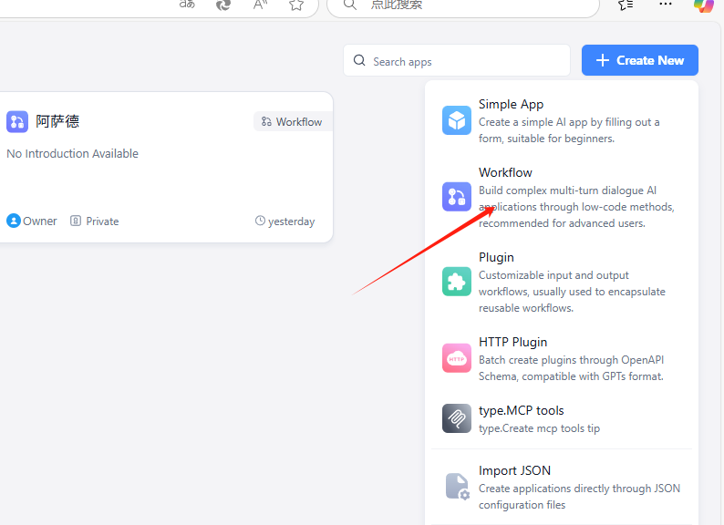
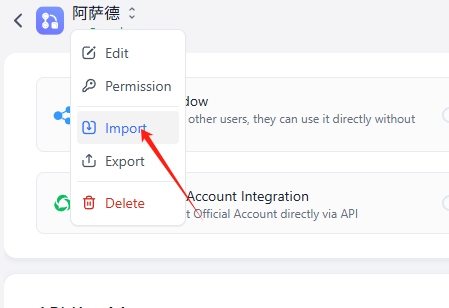
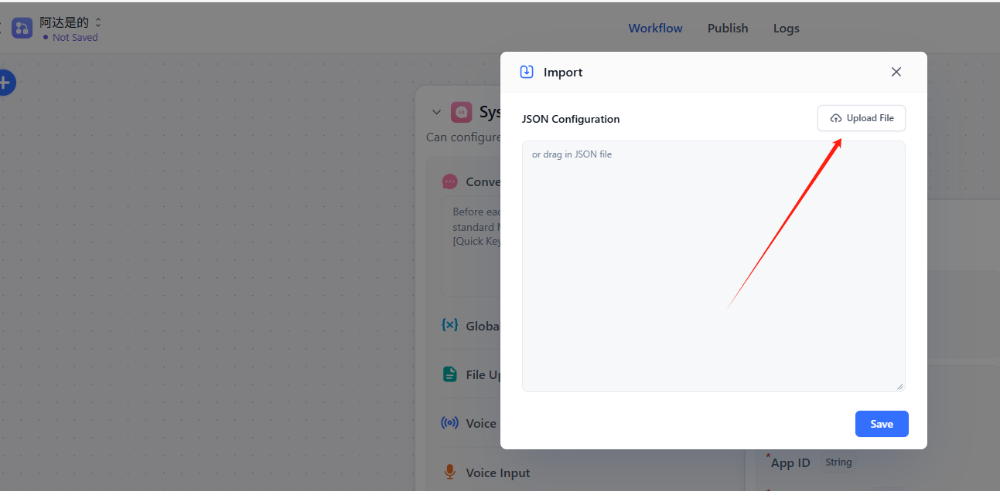
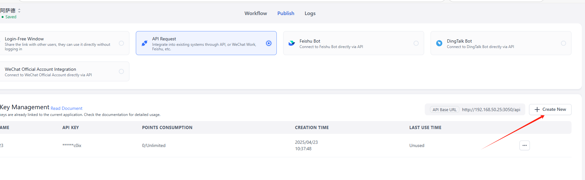
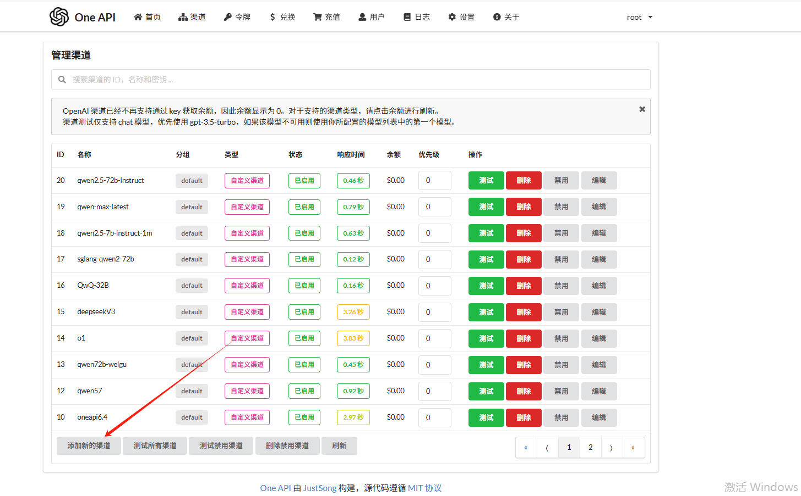
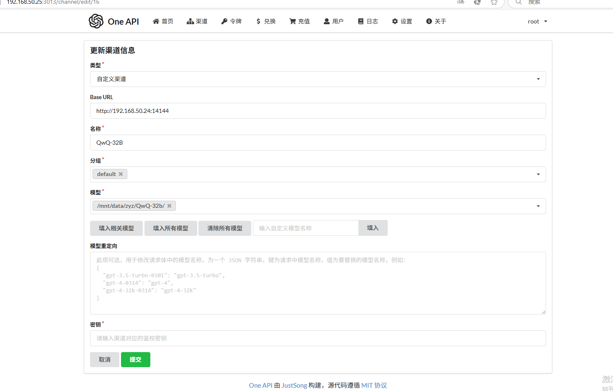
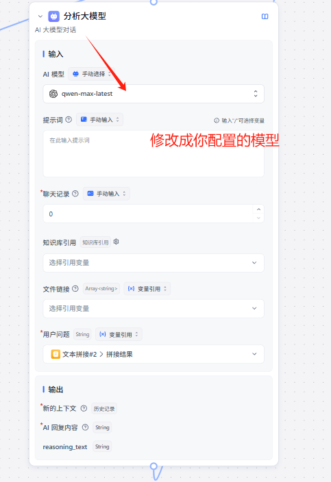

# AutoEP
## [中文](https://github.com/MZY199603/AutoEP/edit/main/README.md)||[EN](https://github.com/MZY199603/AutoEP/edit/main/README-en.md)
## 简介
以下是几个基线：
- [eoh](https://github.com/FeiLiu36/EoH)
- [reeov](https://github.com/ai4co/reevo)

## 1. FastGPT的基础构建（Agent框架构建）
[FastGPT](https://github.com/labring/FastGPT)是一个基于大语言模型的高效知识问答系统，支持私有化部署和自定义工作流搭建。
- **官方GitHub仓库**：[https://github.com/labring/FastGPT](https://github.com/labring/FastGPT)
- **docker-compose**：[https://github.com/labring/FastGPT/blob/main/deploy/docker/docker-compose-oceanbase/docker-compose.yml](https://github.com/labring/FastGPT/blob/main/deploy/docker/docker-compose-oceanbase/docker-compose.yml)

### 1.1 FastGPT的docker启动
执行`docker-compose up -d`命令启动FastGPT。

### 1.2 FastGPT接入本地模型
- **AI Proxy接入**：可参考[https://github.com/labring/FastGPT](https://github.com/labring/FastGPT)进行复现代码，这是一种推荐方式。对应[docker-compose](https://github.com/labring/FastGPT/blob/main/deploy/docker/docker-compose-oceanbase/docker-compose.yml)    
- **oneapi接入**：长期使用推荐此方式，具体接入方法可查看[https://doc.tryfastgpt.ai/docs/development/modelconfig/one-api/](https://doc.tryfastgpt.ai/docs/development/modelconfig/one-api/) 。对应[docker-compose](https://github.com/MZY199603/AutoEP/edit/main/src/docker-compose.yml)

**注意！！！**
相较于接入供应商的模型，建议接入本地部署的私有化大模型，这样实验效率能大幅提升。

### 1.3 API接入
FastGPT可将工作流封装成一个API应用，详细内容请查阅：[https://doc.tryfastgpt.ai/docs/development/openapi/intro/](https://doc.tryfastgpt.ai/docs/development/openapi/intro/) 。

## 2. 数据库部署
### 2.1 数据库搭建
- 本实验选用mysql（8.0.26）进行数据的交互和存储，数据库结构可查看`src/demo.sql`。
- 部署方式既可以采用docker拉取镜像，也能在本地进行安装部署。使用docker部署时，执行`docker pull mysql:8.0.26`命令拉取镜像。

### 2.2 数据库与算法交互和数据库与FastGPT交互
数据库和FastGPT Agent工作流通过Flask进行交互：
1. **更新数据库**：在每次工作流开始时，需将上一轮的效用值更新到对应参数的轮次中。
2. **数据库查询**：为Agent提供5轮次的超参数和对应的效用信息。
3. **插入数据库**：在每次工作流结束时，要将agent输出的超参数新增到下一轮。

数据库和算法的交互主要是把大模型的输出：
4. **查询并作为agent输入**：每次调用FastGPT工作流前，会查询前一轮次的超参数和效用值，并输入给FastGPT。

## 3. 实例演示（TSP）
### 预先步骤！！！！
需先配置模型，具体参考1.2节内容。

### 3.1 快速启动流程
1. **新建工作流**：进入FastGPT控制台，点击右侧的`+新建工作流`。

2. **导入配置**：使用本项目提供的`workflow_export.json`文件导入预定义工作流。工作流导入完成后，将模型替换为自己配置的模型，需将HTTP模块（与data_interaction.py的接口一一对应）替换为本地的IP地址。    

3. **发布工作流**：点击`发布`按钮激活工作流，并记录生成的`workflowId`，用于API调用。同时，需要将`main.py`的`fastgpt`方法中的`key`替换为自己的key。


完成上述三步后，就成功发布了一个agent工作流，代码配置如果没有完成修改可以先发布，后续再更新。（点击保存且发布完成更新）

### 3.2 数据库的启动和main代码运行
1. **数据库加载**：若有图形化管理的数据库软件，直接将[demo.sql](https://github.com/MZY199603/AutoEP/edit/main/src/demo.sql)文件导入mysql即可；若没有，则需将`demo.sql`挂载到mysql容器并运行。
2. **数据库配置**：成功配置数据库后，需修改`main.py`中的`conmysql(self, n)`的数据库配置为自己的数据库配置，同时在`data_interaction`中也进行相应修改。
3. **代码运行**：
    - 第一步：启动`data_interaction.py`，运行该文件需要安装Flask、pymysql等包。启动成功后，可查看数据接口的运行状态。
    - 第二步：启动`main.py`文件，启动前需进行检查：
        - agent工作流中的Http模块与`data_interaction`的端口IP是否匹配。
        - 模型是否配置成功，可先搭建简易工作流进行测试。
        - 3.1节的第三步是否完成替换操作。
    上述三项检查完成后，即可运行`main.py`。

## 4. OneApi模型接入（复现本实验暂时不需要，若有需要可参考以下内容）
### 通过本文提供的`src/docker-compose.yaml`进行部署
1. 打开oneapi网站，按上述`docker-compose`部署后，访问地址为本地路由地址：3013。
2. 打开导航条上的“渠道”，添加新的渠道，选择自定义渠道，填入Base_url、渠道名称、模型名称以及你的KEY。模型名称、Base_url和key需从deepseek、openai等获取后填入，若是本地部署的模型，则需支持openai的接口方式调用。


3. 若首次使用oneapi，需点击令牌列获取令牌和key，然后修改`docker-compose.yaml`的fastgpt配置中的以下两项：
    - `OPENAI_BASE_URL=http://本地IP或路由IP:3013/v1`
    - `CHAT_API_KEY=刚刚获得的key`（开始时默认填写了OneAPI的快速默认key，测试通过后，修改为新获取的令牌key）
4. 增加LLM后，需在配置`config.json`文件中增加添加的渠道，示例如下：
```json
"llmModels": [{ 
    "model": "gpt-3.5-turbo", //模型名称  
    "name": "gpt-3.5-turbo", //填入新增的渠道名称，下述其他按照需要进行调整，可以不变。  
    "maxContext": 16000, 
    "avatar": "/imgs/model/openai.svg", 
    "maxResponse": 4000, 
    "quoteMaxToken": 13000, 
    "maxTemperature": 1.2, 
    "charsPointsPrice": 0,
    "censor": false, 
    "vision": false,
    "datasetProcess": true,
    "usedInClassify": true,
    "usedInExtractFields": true,
    "usedInToolCall": true,
    "usedInQueryExtension": true,
    "toolChoice": true,
    "functionCall": true,
    "customCQPrompt": "",
    "customExtractPrompt": "",
    "defaultSystemChatPrompt": "",
    "defaultConfig": {}
}]
   5.配置完成后需要重启服务
   命令 docker-compose down
   docker-compose up-d
   6.workflow中所有LLM换成你配置的LLM即可
   


     
